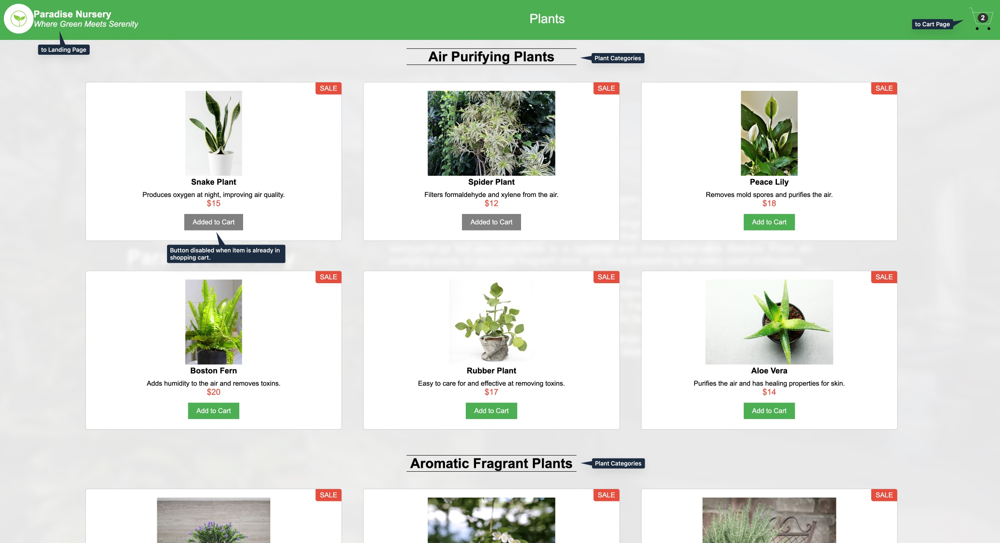
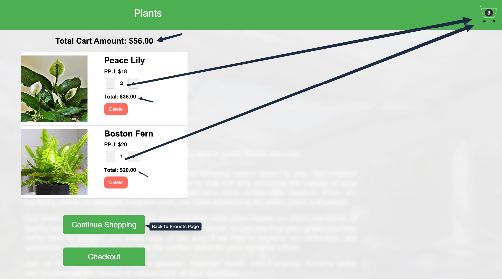

<!-- @format -->

# Paradise Nursery - Plant Shopping Application

## Overview

Paradise Nursery is a React-based e-commerce application that offers a variety of houseplants. Users can browse through different categories of plants, add them to their cart, and manage their shopping cart before checkout.

This project was developed as the final certification project for IBM CAD0210EN Developing Front End Apps with React, a collaborative program between IBM, Technical University of Munich, and edX.

## Context
This application demonstrates proficiency in:
- Creating functional React components
- Managing state with Redux
- Implementing React Hooks (useState, useEffect)
- Component composition and nesting
- Event handling and dynamic data rendering

## Features

### Landing Page

- Welcoming interface with background image
- Company introduction
- "Get Started" button to access the product catalog


### Product Listing

- Categorized plant display (Air Purifying, Aromatic, Medicinal, etc.)
- Detailed product cards with:
  - Plant images
  - Names and descriptions
  - Prices
  - Add to cart functionality
  - Button disabled when item is already in shopping cart

  

### Shopping Cart

- Real-time cart quantity indicator
- Item quantity management
- Total cost calculation
- Remove items functionality
- Continue shopping option



## Technologies Used

- React.js
- Redux Toolkit (State Management)
- CSS3 (Styling)

## Prerequisites
- Node.js (v14.0.0 or higher)
- npm (v6.0.0 or higher)

## Installation
```bash
# Clone the repository
git clone https://github.com/juaneugenio/e-plantShopping.git

# Navigate to project directory
cd e-plantShopping

# Install dependencies
npm install

# Run the development server
npm run dev 
```

## Usage

1. Open the landing page
2. Click "Get Started" to view products
3. Browse through plant categories
4. Add desired plants to cart
5. Manage cart items through the cart interface
6. Checkout functionality is not implemented yet.

## Contributing
1. Fork the repository
2. Create your feature branch ( git checkout -b feature/AmazingFeature )
3. Commit your changes ( git commit -m 'Add some AmazingFeature' )
4. Push to the branch ( git push origin feature/AmazingFeature )
5. Open a Pull Request
## License
This project is licensed under the MIT License - see the LICENSE.md file for details

## Contact
Juan C. Eugenio: [E-mail Address](mailto:jc.eugenio@proton.me)
Project Link: [Paradise Nursery](https://github.com/juaneugenio/e-plantShopping)


## Acknowledgments
- Images and base project structure provided by IBM Skills Network
- This project is for educational purposes only and has no commercial intent
- Special thanks to the instructional team:
  - Primary Instructor: Richa Arora
  - Project Lead: Rav Ahuja
  - Instructional Designer: Bethany Hudnutt
  - Technical Advisor: Richa Arora
  - Teaching Assistants: K Sundararajan, Anamika Agarwal

## Copyright Notice
- This project was developed as part of IBM Skills Network educational program
- IBM®, the IBM logo, and ibm.com® are trademarks of International Business Machines Corporation
- This educational project makes no commercial claims and is intended solely for learning purposes
- All product and service names mentioned may be trademarks of their respective companies